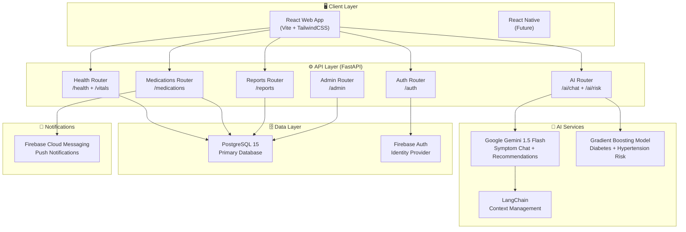
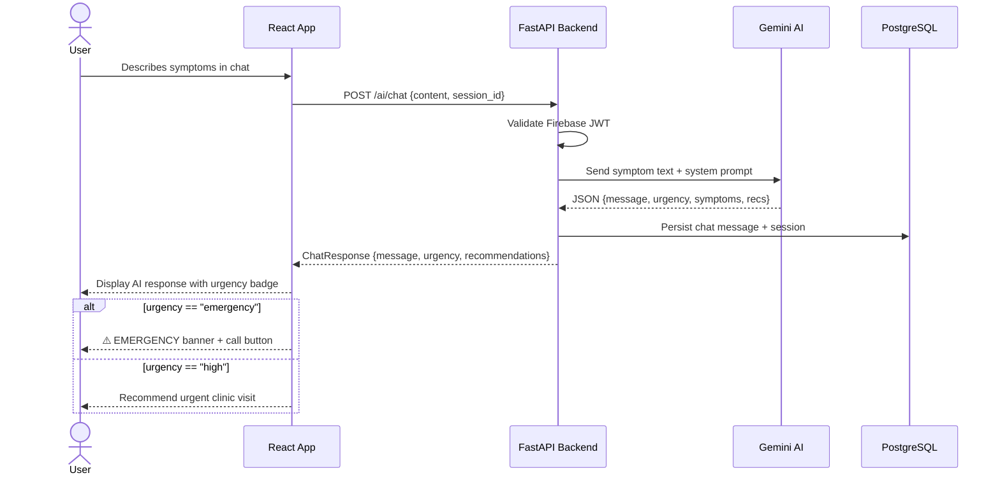
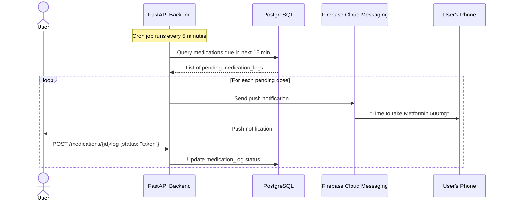
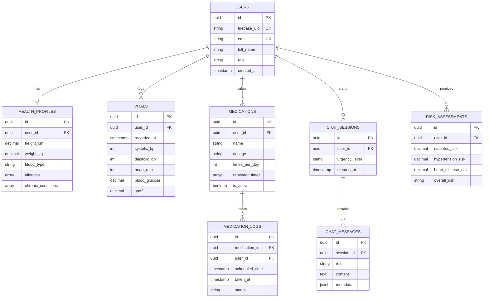
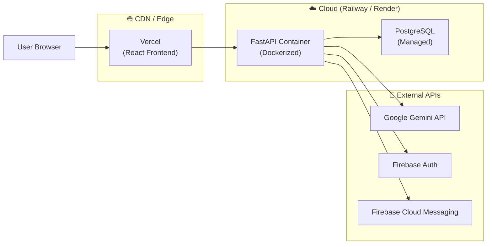

# MediAid — System Architecture

## High-Level Architecture

---

## User Journey — Symptom Check Flow

---

## Medication Reminder Flow

---

## Data Model (ERD)

---

## Deployment Architecture

